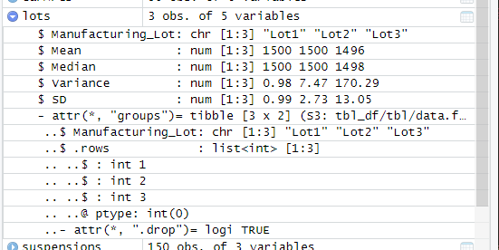
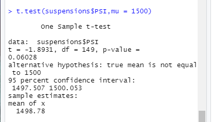

# MechaCar_Statistical_Analysis
## Linear Regression to Predict MPG
*   Which variables/coefficients provided a non-random amount of variance to the mpg values in the dataset?
The three variables that provided a non-random amount of variance was Vehicle-Weight with a value of .078, Spoiler_Angle with a value of .31
and AWD with a  value of .19.

*   Is the slope of the linear model considered to be zero? Why or why not?
The slope of the linear model is not considered to be zero. This is because some of the coeffecients have a relationship with MPG. 

*   Does this linear model predict mpg of MechaCar prototypes effectively? Why or why not?
Yes, this does predict mpg mechCar prototypes effectively. We can say this with confidence due to our multiple R squared value being .72, and our adjusted value being .68.

## Summary Statistics on Suspension Coils
Both lots 1 and lot 2 have a variance lower than 100 lbs per square inch. However, lot 3 does not meet the current manufacturing  specification.This can be seen below.

 When we take the total summary of all of our lots (as seen by total summary) is within that margin.
 

 ## T-Tests on Suspension Coils
 The first t test that we performed produced a p-value of .06 so we can assume that there is no significance in comparing the lots against the mean PSI of 1500.
 
Next we performed a t-test on lot one that produced a p-value of 1 so we can assume that it is no significant in comparing this lots PSI against the mean PSI of 1500.

Lot 2 in comparison has a p-value of .6072 so we can assume that there is no significance in comparing this lots PSI against the mean of 1500.

Lot 3 in comparison has a p-value of .04 so we can asssume that there is significance in comparing this lots PSI against the mean of 1500.

## Study Design:MechCar vs Competition
The metric that is of interest for my customer is safety rating. With this we will compare vehicle_length, and vehicle_weight with that of the safety rating. The null hypothese would be that vehicle weight and length have no affect on safety rating, whereas the alternative is that vehicle weight and length directly correlate to safety rating. I would probably use 1 or two sample t-tests. This would be in order to compare the statistical likelihood that the mean of safety rating is correlated with a vehicle weight or length or not. The data that we need to perform this is obviously the vehicle length, the vehicle weight, and the manufacturers safety rating.